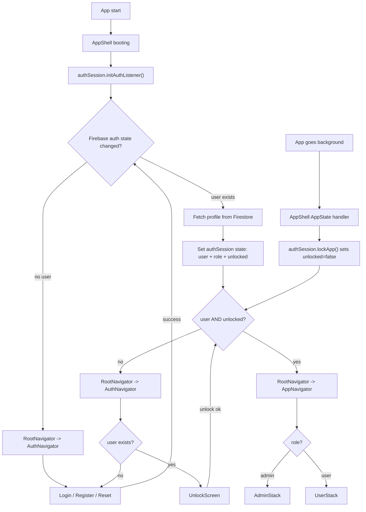

```mermaid
flowchart TD
  A["App start"] --> B["AppShell booting"]
  B --> C["authSession.initAuthListener()"]
  C --> D{"Firebase auth state changed?"}

  D -->|no user| E["RootNavigator -> AuthNavigator"]
  E --> E1["Login / Register / Reset"]
  E1 -->|success| D

  D -->|user exists| F["Fetch profile from Firestore"]
  F --> G["Set authSession state: user + role + unlocked"]
  G --> H{"user AND unlocked?"}

  H -->|no| I["RootNavigator -> AuthNavigator"]
  I --> J{"user exists?"}
  J -->|yes| K["UnlockScreen"]
  K -->|unlock ok| H
  J -->|no| E1

  H -->|yes| L["RootNavigator -> AppNavigator"]
  L --> M{"role?"}
  M -->|admin| N["AdminStack"]
  M -->|user| O["UserStack"]

  P["App goes background"] --> Q["AppShell AppState handler"]
  Q --> R["authSession.lockApp() sets unlocked=false"]
  R --> H
```