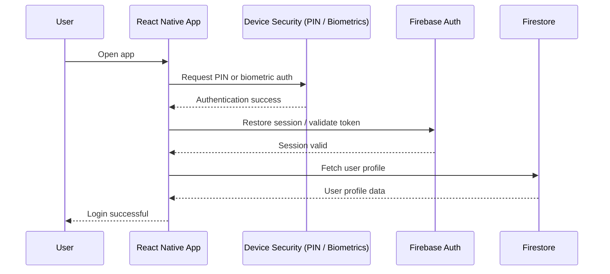

```mermaid
sequenceDiagram
    participant U as User
    participant APP as React Native App
    participant OS as Device Security (PIN / Biometrics)
    participant AUTH as Firebase Auth
    participant DB as Firestore

    U->>APP: Open app
    APP->>OS: Request PIN or biometric auth
    OS-->>APP: Authentication success
    APP->>AUTH: Restore session / validate token
    AUTH-->>APP: Session valid
    APP->>DB: Fetch user profile
    DB-->>APP: User profile data
    APP-->>U: Login successful

```