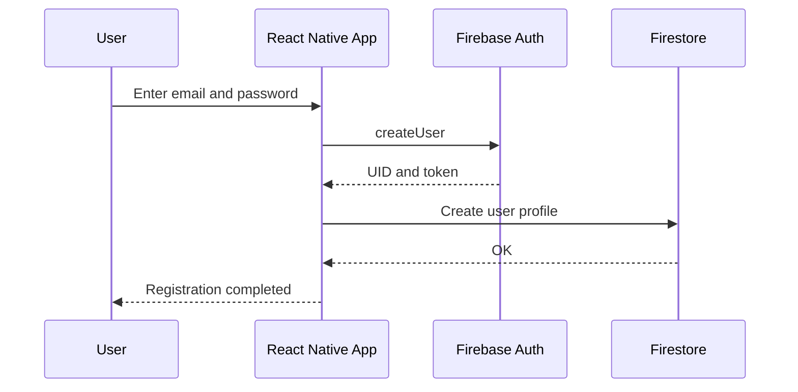

```mermaid
sequenceDiagram
    participant U as User
    participant APP as React Native App
    participant AUTH as Firebase Auth
    participant DB as Firestore

    U->>APP: Enter email and password
    APP->>AUTH: createUser
    AUTH-->>APP: UID and token
    APP->>DB: Create user profile
    DB-->>APP: OK
    APP-->>U: Registration completed

```