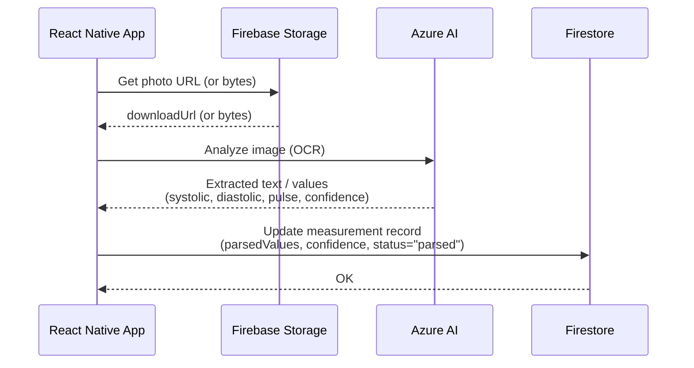

```mermaid
sequenceDiagram
    participant APP as React Native App
    participant STORE as Firebase Storage
    participant AI as Azure AI
    participant DB as Firestore

    APP->>STORE: Get photo URL (or bytes)
    STORE-->>APP: downloadUrl (or bytes)
    APP->>AI: Analyze image (OCR)
    AI-->>APP: Extracted text / values<br>(systolic, diastolic, pulse, confidence)
    APP->>DB: Update measurement record<br>(parsedValues, confidence, status="parsed")
    DB-->>APP: OK
```