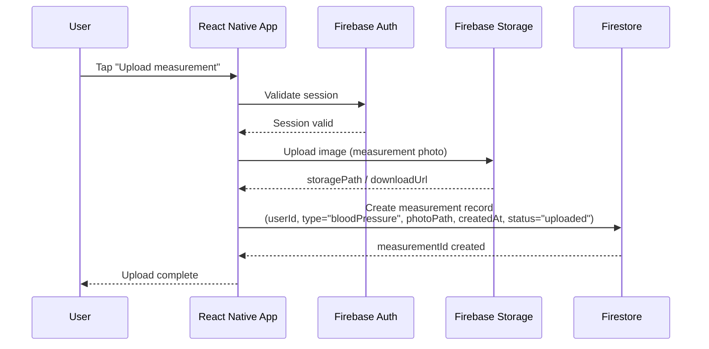

```mermaid
sequenceDiagram
    participant U as User
    participant APP as React Native App
    participant AUTH as Firebase Auth
    participant STORE as Firebase Storage
    participant DB as Firestore

    U->>APP: Tap "Upload measurement"
    APP->>AUTH: Validate session
    AUTH-->>APP: Session valid
    APP->>STORE: Upload image (measurement photo)
    STORE-->>APP: storagePath / downloadUrl
    APP->>DB: Create measurement record<br>(userId, type="bloodPressure", photoPath, createdAt, status="uploaded")
    DB-->>APP: measurementId created
    APP-->>U: Upload complete
```