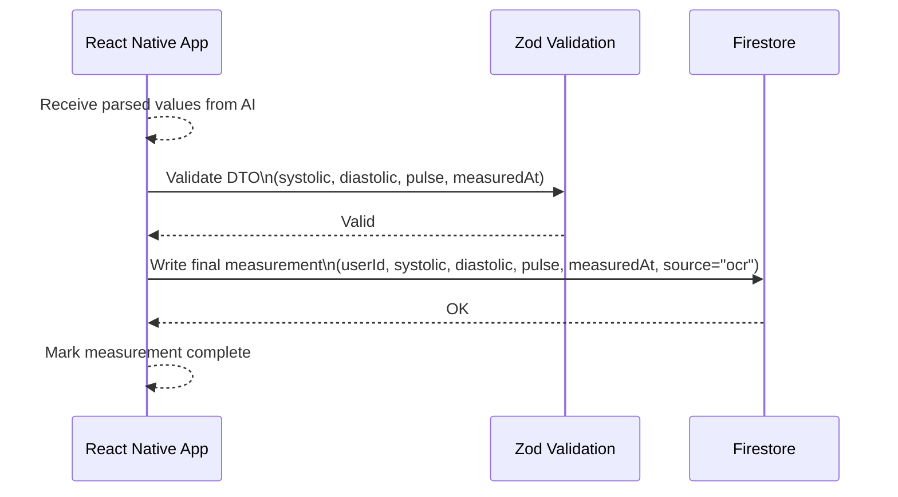

```mermaid
sequenceDiagram
    participant APP as React Native App
    participant Z as Zod Validation
    participant DB as Firestore

    APP-->>APP: Receive parsed values from AI
    APP->>Z: Validate DTO\n(systolic, diastolic, pulse, measuredAt)
    Z-->>APP: Valid
    APP->>DB: Write final measurement\n(userId, systolic, diastolic, pulse, measuredAt, source="ocr")
    DB-->>APP: OK
    APP-->>APP: Mark measurement complete
```