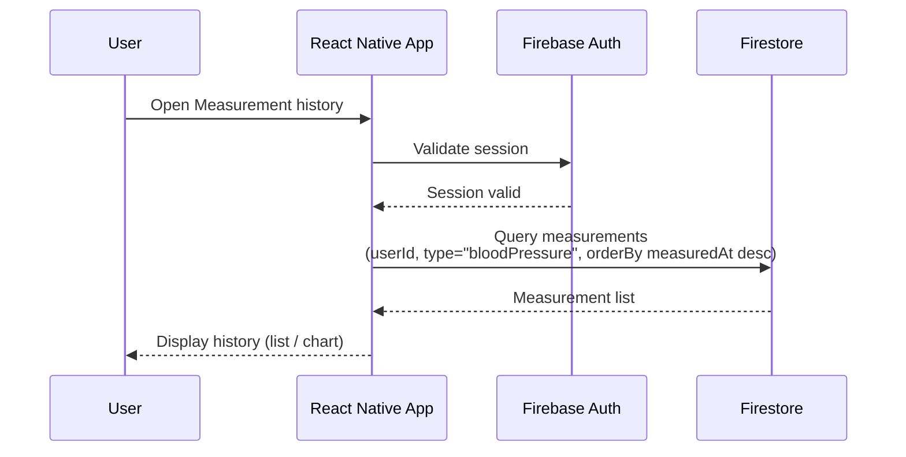

```mermaid
sequenceDiagram
    participant U as User
    participant APP as React Native App
    participant AUTH as Firebase Auth
    participant DB as Firestore

    U->>APP: Open Measurement history
    APP->>AUTH: Validate session
    AUTH-->>APP: Session valid
    APP->>DB: Query measurements<br>(userId, type="bloodPressure", orderBy measuredAt desc)
    DB-->>APP: Measurement list
    APP-->>U: Display history (list / chart)
```