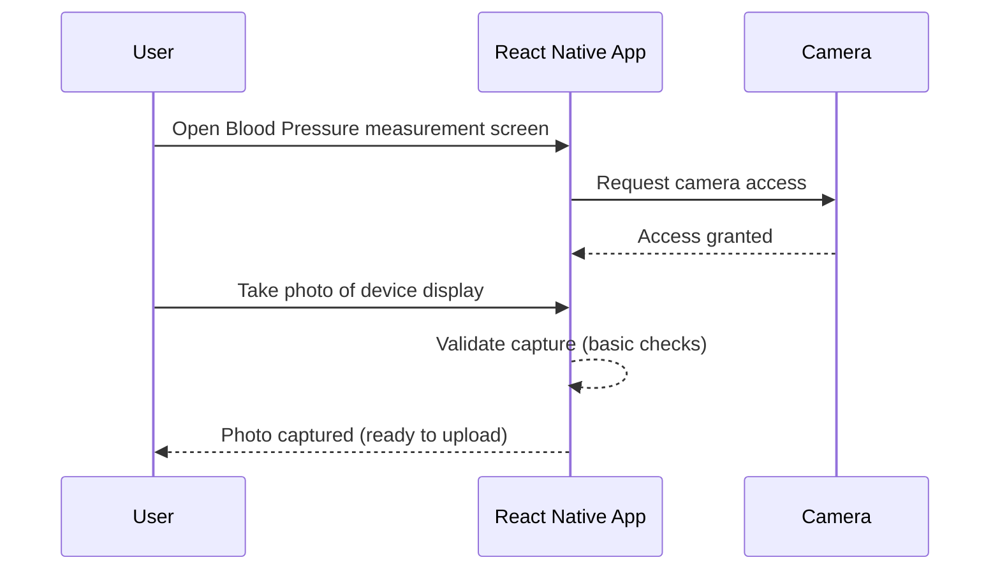

```mermaid
sequenceDiagram
    participant U as User
    participant APP as React Native App
    participant CAM as Camera

    U->>APP: Open Blood Pressure measurement screen
    APP->>CAM: Request camera access
    CAM-->>APP: Access granted
    U->>APP: Take photo of device display
    APP-->>APP: Validate capture (basic checks)
    APP-->>U: Photo captured (ready to upload)
```