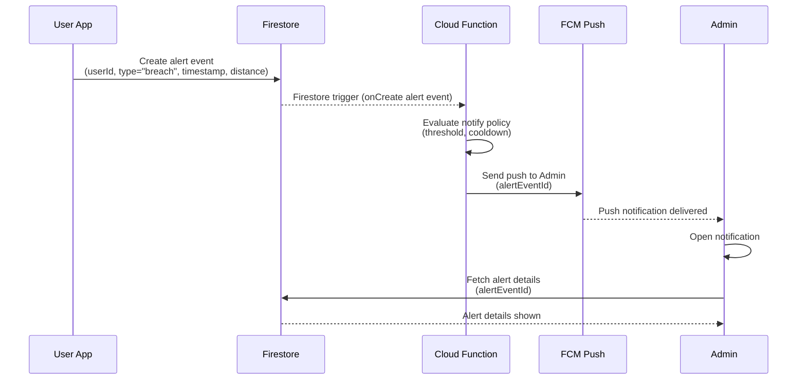

```mermaid
sequenceDiagram
    participant UAPP as User App
    participant DB as Firestore
    participant CF as Cloud Function
    participant FCM as FCM Push
    participant A as Admin

    UAPP->>DB: Create alert event<br>(userId, type="breach", timestamp, distance)
    DB-->>CF: Firestore trigger (onCreate alert event)
    CF->>CF: Evaluate notify policy<br>(threshold, cooldown)
    CF->>FCM: Send push to Admin<br>(alertEventId)
    FCM-->>A: Push notification delivered
    A->>A: Open notification
    A->>DB: Fetch alert details<br>(alertEventId)
    DB-->>A: Alert details shown
```