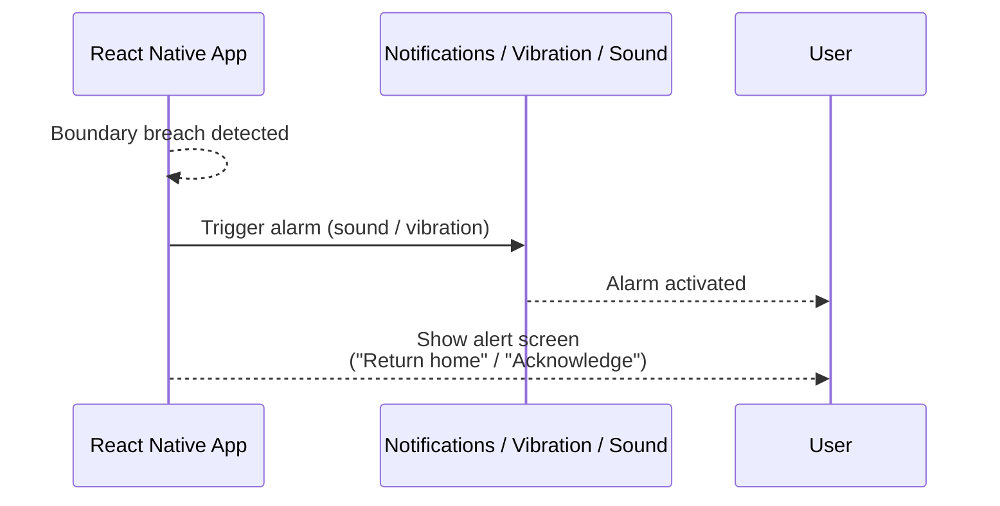

```mermaid
sequenceDiagram
    participant APP as React Native App
    participant OS as Notifications / Vibration / Sound
    participant U as User

    APP-->>APP: Boundary breach detected
    APP->>OS: Trigger alarm (sound / vibration)
    OS-->>U: Alarm activated
    APP-->>U: Show alert screen<br>("Return home" / "Acknowledge")
```