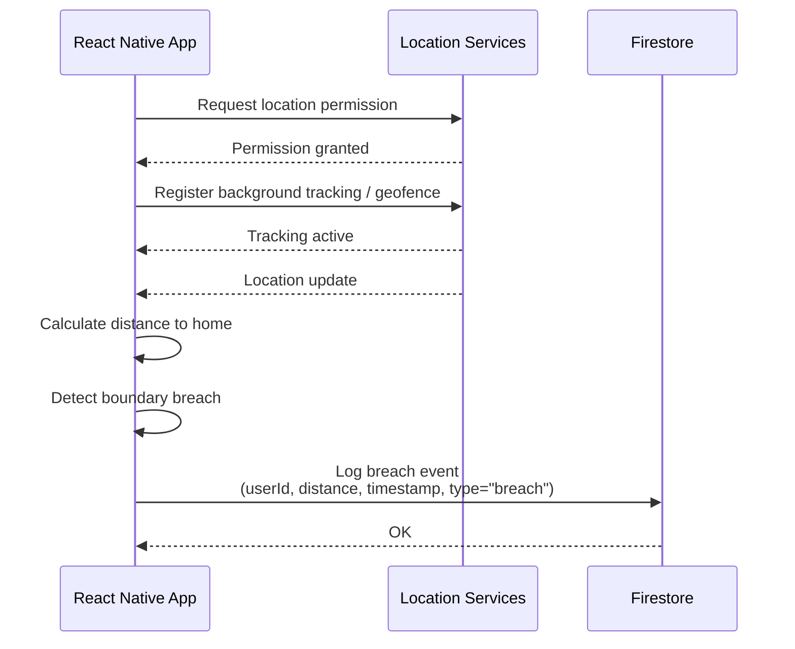

```mermaid
sequenceDiagram
    participant APP as React Native App
    participant OS as Location Services
    participant DB as Firestore

    APP->>OS: Request location permission
    OS-->>APP: Permission granted
    APP->>OS: Register background tracking / geofence
    OS-->>APP: Tracking active

    OS-->>APP: Location update
    APP->>APP: Calculate distance to home
    APP->>APP: Detect boundary breach

    APP->>DB: Log breach event<br>(userId, distance, timestamp, type="breach")
    DB-->>APP: OK
```