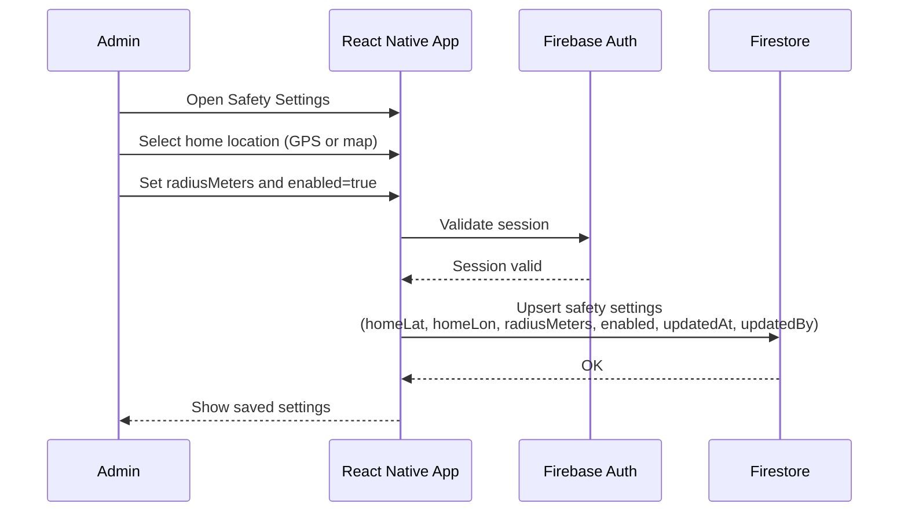

```mermaid
sequenceDiagram
    participant A as Admin
    participant APP as React Native App
    participant AUTH as Firebase Auth
    participant DB as Firestore

    A->>APP: Open Safety Settings
    A->>APP: Select home location (GPS or map)
    A->>APP: Set radiusMeters and enabled=true
    APP->>AUTH: Validate session
    AUTH-->>APP: Session valid
    APP->>DB: Upsert safety settings<br>(homeLat, homeLon, radiusMeters, enabled, updatedAt, updatedBy)
    DB-->>APP: OK
    APP-->>A: Show saved settings
```