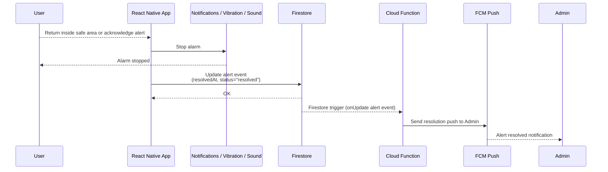

```mermaid
sequenceDiagram
    participant U as User
    participant APP as React Native App
    participant OS as Notifications / Vibration / Sound
    participant DB as Firestore
    participant CF as Cloud Function
    participant FCM as FCM Push
    participant A as Admin

    U-->>APP: Return inside safe area or acknowledge alert
    APP->>OS: Stop alarm
    OS-->>U: Alarm stopped
    APP->>DB: Update alert event<br>(resolvedAt, status="resolved")
    DB-->>APP: OK
    DB-->>CF: Firestore trigger (onUpdate alert event)
    CF->>FCM: Send resolution push to Admin
    FCM-->>A: Alert resolved notification
```