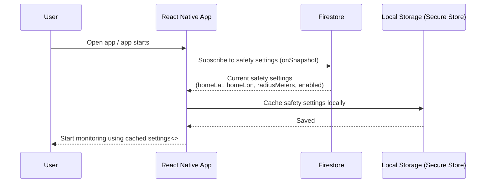

```mermaid
sequenceDiagram
    participant U as User
    participant APP as React Native App
    participant DB as Firestore
    participant LS as Local Storage (Secure Store)

    U->>APP: Open app / app starts
    APP->>DB: Subscribe to safety settings (onSnapshot)
    DB-->>APP: Current safety settings<br>(homeLat, homeLon, radiusMeters, enabled)
    APP->>LS: Cache safety settings locally
    LS-->>APP: Saved
    APP-->>U: Start monitoring using cached settings<>
```