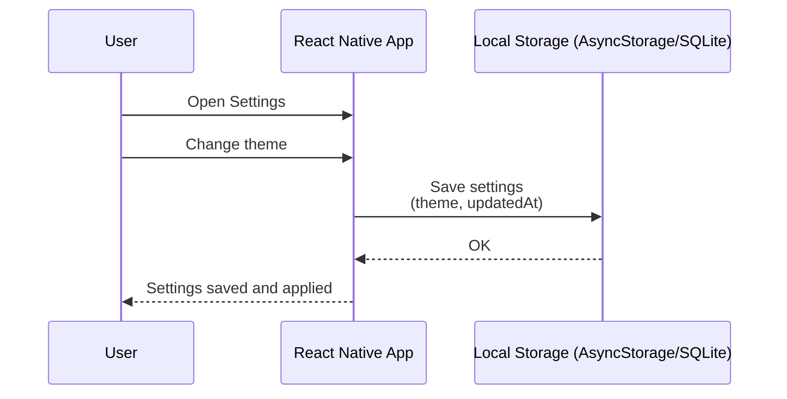

```mermaid
sequenceDiagram
    participant U as User
    participant APP as React Native App
    participant LS as Local Storage (AsyncStorage/SQLite)

    U->>APP: Open Settings
    U->>APP: Change theme
    APP->>LS: Save settings<br>(theme, updatedAt)
    LS-->>APP: OK
    APP-->>U: Settings saved and applied
```