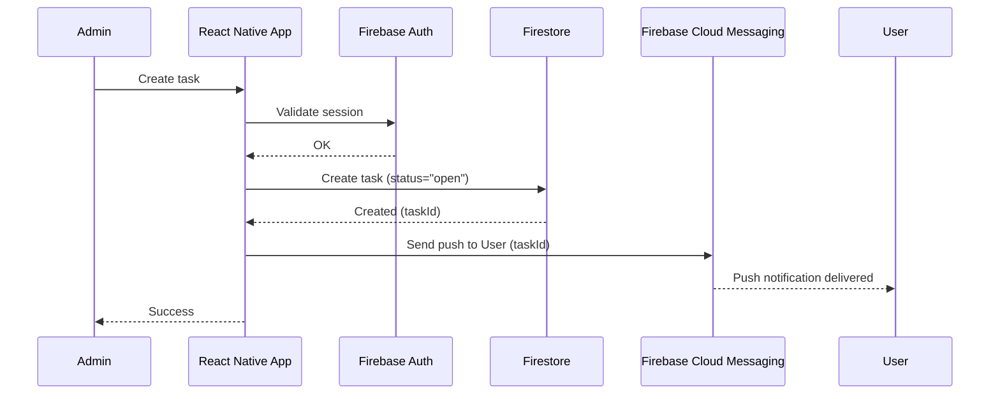

```mermaid
sequenceDiagram
    participant A as Admin
    participant APP as React Native App
    participant AUTH as Firebase Auth
    participant DB as Firestore
    participant FCM as Firebase Cloud Messaging
    participant U as User

    A->>APP: Create task
    APP->>AUTH: Validate session
    AUTH-->>APP: OK
    APP->>DB: Create task (status="open")
    DB-->>APP: Created (taskId)
    APP->>FCM: Send push to User (taskId)
    FCM-->>U: Push notification delivered
    APP-->>A: Success
```