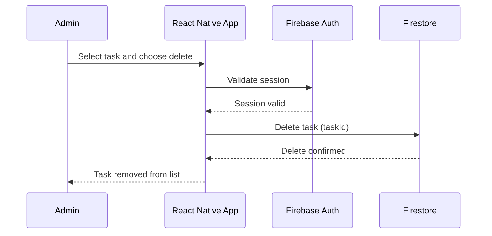

```mermaid
sequenceDiagram
    participant A as Admin
    participant APP as React Native App
    participant AUTH as Firebase Auth
    participant DB as Firestore

    A->>APP: Select task and choose delete
    APP->>AUTH: Validate session
    AUTH-->>APP: Session valid
    APP->>DB: Delete task (taskId)
    DB-->>APP: Delete confirmed
    APP-->>A: Task removed from list
```