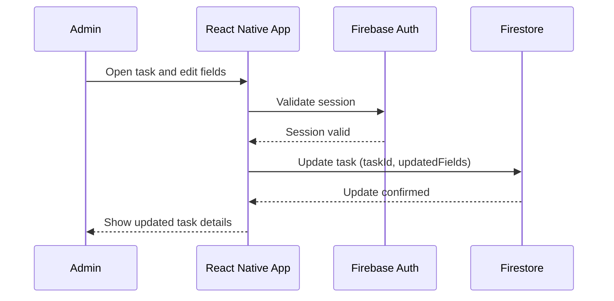

```mermaid
sequenceDiagram
    participant A as Admin
    participant APP as React Native App
    participant AUTH as Firebase Auth
    participant DB as Firestore

    A->>APP: Open task and edit fields
    APP->>AUTH: Validate session
    AUTH-->>APP: Session valid
    APP->>DB: Update task (taskId, updatedFields)
    DB-->>APP: Update confirmed
    APP-->>A: Show updated task details
```